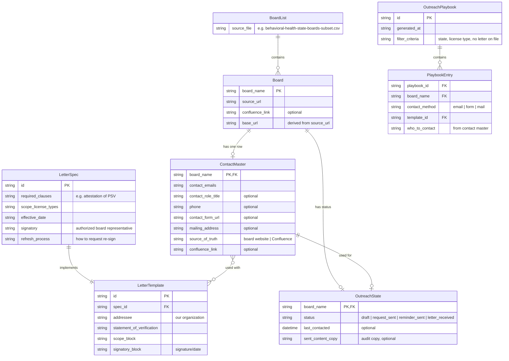
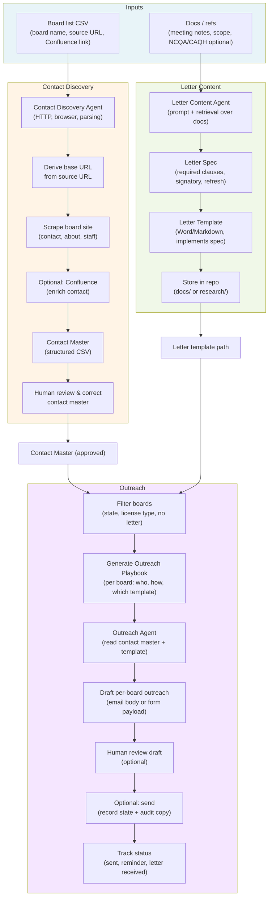

# Agentic Contact Letter — ER and Flow Diagrams

From [prd-agentic-contact-letter.md](./prd-agentic-contact-letter.md).

---

## 1. Entity-Relationship Diagram

Entities and relationships for contact discovery, letter content, and outreach.

Source: [prd-agentic-contact-letter-er.mmd](./prd-agentic-contact-letter-er.mmd)

---

## 2. System Flow Diagram

End-to-end flow: inputs → agents → artifacts → outreach.

Source: [prd-agentic-contact-letter-flow.mmd](./prd-agentic-contact-letter-flow.mmd)

---

### Flow summary

| Phase | Input | Agent / step | Output |
|-------|--------|---------------|--------|
| Contact Discovery | Board list CSV | Contact Discovery Agent (scrape + optional Confluence) | Contact Master → human review |
| Letter Content | Docs, meeting notes, scope | Letter Content Agent | Letter Spec + Letter Template (in repo) |
| Outreach | Contact Master, Letter Template, filter | Playbook gen → Outreach Agent | Draft (or send) per board → track status |
